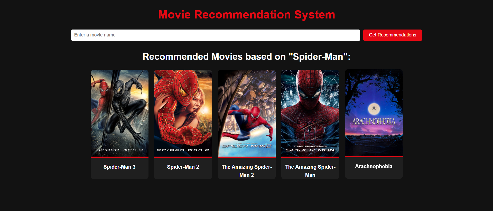

# Movie Prediction Project

## Overview
This is a Movie Recommendation System built using Python, Flask, and machine learning techniques. The system recommends movies based on user input and displays their posters by fetching data from the TMDb API.

## Features
- Recommend similar movies based on user selection.
- Fetch and display movie posters from the TMDb API.
- Uses Natural Language Processing (NLP) techniques to process movie data.
- Implements cosine similarity for movie recommendations.

## Technologies Used
- Python
- Flask (for web application)
- Pandas & NumPy (for data processing)
- Scikit-learn (for vectorization & similarity calculation)
- TMDb API (for fetching movie posters)
- Pickle (for saving and loading trained models)

## Installation
### Prerequisites
Make sure you have Python installed on your system.

### Steps
1. Clone the repository:
   ```sh
   git clone https://github.com/your-repo/movie-prediction.git
   cd movie-prediction
   ```

2. Install the required dependencies:
   ```sh
   pip install -r requirements.txt
   ```

3. Download the dataset and place it inside the `Data` folder:
   - `tmdb_5000_movies.csv`
   - `tmdb_5000_credits.csv`

4. Run the preprocessing script to create `movie_list.pkl` and `similarity.pkl`:
   ```sh
   python preprocess.py
   ```

5. Run the Flask application:
   ```sh
   python app.py
   ```

6. Open the web browser and go to:
   ```
   http://127.0.0.1:5000/
   ```

## Project Structure
```
movie-prediction/
│── Data/
│   ├── tmdb_5000_movies.csv
│   ├── tmdb_5000_credits.csv
│── model/
│   ├── movie_list.pkl
│   ├── similarity.pkl
│── templates/
│   ├── index.html
│── static/
│── app.py
│── preprocess.py
│── requirements.txt
│── README.md
```

## How It Works
1. The dataset (`tmdb_5000_movies.csv` and `tmdb_5000_credits.csv`) is processed using Pandas.
2. Data is cleaned, and relevant features like `genres`, `keywords`, `cast`, and `crew` are extracted.
3. A bag-of-words model is created using `CountVectorizer`.
4. Cosine similarity is calculated between movies.
5. The recommendation function finds the most similar movies.
6. The Flask app takes user input and displays recommended movies along with their posters fetched via the TMDb API.

## API Usage
The project fetches movie posters using the TMDb API. To use it, replace `api_key` in `app.py` with your own TMDb API key.

```python
url = f"https://api.themoviedb.org/3/movie/{movie_id}?api_key=YOUR_API_KEY&language=en-US"
```

## Future Enhancements
- Improve recommendation accuracy using deep learning models.
- Add more filtering options like genre, release year, etc.
- Deploy the application using cloud services like AWS or Heroku.

## License
This project is open-source and free to use under the MIT License.

## Author 
Tanmay Rathod